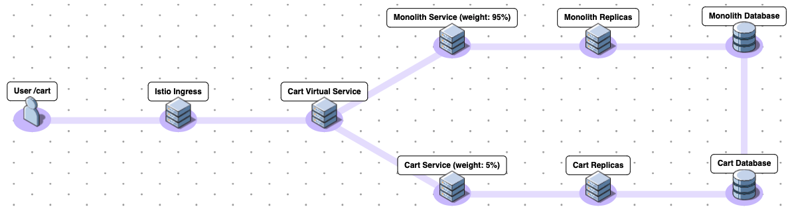

# Hash - Desafio de Arquitetura

[Clique aqui](https://github.com/hashlab/hiring/blob/master/challenges/pt-br/sre-challenge.md) para acessar o desafio.

## Projetos da implantação do rollout:

- [terraform-google-cloud-network](https://github.com/letsrockthefuture/terraform-google-cloud-network): Responsável por provisionar a infraestrutura de rede no Google Cloud para o nosso Kubernetes Engine cluster;
- [terraform-google-kubernetes-engine](https://github.com/letsrockthefuture/terraform-google-cloud-kubernetes-engine): Responsável por criar nosso Kubernetes Engine cluster e os node pools para nossas aplicações;
- [Monolith](https://github.com/letsrockthefuture/monolith): Aplicação que será dividida em dois microserviços independentes, Cart e Checkout;
- [Cart](https://github.com/letsrockthefuture/cart): Microserviço reponsável pelo carrinho de compras;
- [Checkout](https://github.com/letsrockthefuture/checkout) Microserviço reponsável por finalizar a compra.

## Considerações:

- Abordaremos o canary deployment para realizar o rollout transparente das aplicações, e para isso, utilizamos o Istio como gerenciador da implantação;
- Front-end já está desacoplado do Monolith;
- Demais microserviços que compõe a aplicação completa já são contenerizados, executados no Kubernetes e configurados com Istio;
- Alguns microserviços que dependem do Cart e Checkout serão atualizados no decorrer da migração, mais especificamente, os apontamentos para os services do Kubernetes;
- Utilizamos infraestrutura como código com Terraform em projetos distintos entre infraestrutura e aplicação;
- Utilizamos o conceito de GitOps para a implementação dos nossos projetos;
- Fluxo contínuo de implementação com alguma suposta ferramenta de CI/CD e com pipeline configurada no próprio repositório do código, ativada via branch "main";
- Organização e projeto criados no Google Cloud, e com billing account ativo;
- Cloud Resource Manager API e Container API habilitados na Cloud;
- Database única para o serviço monolith;
- Quebramos o Cart e Checkout em dois microserviços independentes;
- Não abordaremos a migração dos dados nos projetos.

## Tecnologias utilizadas:

- Terraform;
- Google Cloud;
- Google Kubernetes Engine;
- Docker;
- Istio configurado a partir de addons (beta) via Terraform, sem Kiali e Grafana (tínhamos a opção de provisionar via Helm ou manifests do Kubernetes).

## Extraindo os microserviços:

1. Identificamos os módulos e dependências da funcionalidade de /cart dentro do Monolith, tal como comunicação entre os demais serviços, e tabelas/estrutura de banco de dados;

2. Criamos um novo projeto no GitHub com o código da nova funcionalidade de /cart (API) e refatoramos para uma nova versão do Monolith para adaptar-se à nova estrutura. Assim, temos um novo microserviço utilizando um banco de dados desacoplado da infraestrutura do Monolith e pronto para receber requisição dos demais serviços, lembrando que será necessário refatorarmos os demais serviços que consomem o atual Monolith para apontarem para a nova API;

3. Com as novas versões atualizadas e no ar, realizamos o rollout do tipo canary, configurando o Istio para realizar o traffic shifting de 95% para o Monolith e 5% para o novo microserviço que passa a lidar com as requisições do /cart. A partir deste momento, desde que bem monitorado e sem impacto no funcionamento das aplicações, aumentamos o traffic shifting até chegar em 100% do direcionamento para o Cart;

#### Rollout canary para o microserviço Cart:

4. Repetimos o esforço para o microserviço de Checkout.

#### Rollout canary para o microserviço Checkout:

## Referências:

- [Migrating a monolithic application to microservices on Google Kubernetes Engine - Google Cloud](https://cloud.google.com/solutions/migrating-a-monolithic-app-to-microservices-gke)
- [Supporting your migration with Istio mesh expansion: Concept - Google Cloud](https://cloud.google.com/solutions/supporting-your-migration-with-istio-mesh-expansion-concept)
- [Migrating a Monolithic Website to Microservices on Google Kubernetes Engine - Qwiklabs](https://www.qwiklabs.com/focuses/11953?parent=catalog)
- [How to break a Monolith into Microservices - Martin Fowler](https://martinfowler.com/articles/break-monolith-into-microservices.html)
- [Low-risk Monolith to Microservice Evolution Part I - Christian Posta](https://blog.christianposta.com/microservices/low-risk-monolith-to-microservice-evolution/)
- [Low-risk Monolith to Microservice Evolution Part II - Christian Posta](https://blog.christianposta.com/microservices/low-risk-monolith-to-microservice-evolution-part-ii/)
- [Low-risk Monolith to Microservice Evolution Part III - Christian Posta](https://blog.christianposta.com/microservices/low-risk-monolith-to-microservice-evolution-part-iii/)