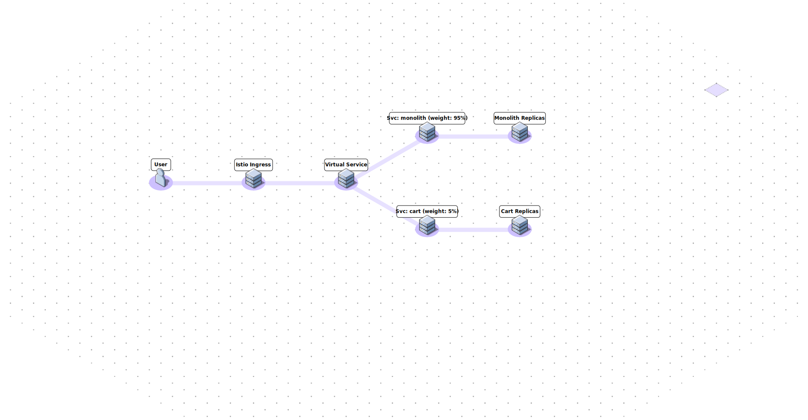

# Hash • Desafio de Arquitetura

[Clique aqui](https://github.com/hashlab/hiring/blob/master/challenges/pt-br/sre-challenge.md) para acessar o desafio.

## Premissas:

- Abordaremos o canary deployment para realizar o rollout transparente das aplicações, e para isso, utilizamos o Istio como gerenciador da implantação;
- Front-end já está desacoplado do Monolith;
- Outros microserviços que compõe a aplicação completa já são contenerizados e executados no Kubernetes e configurados com Istio;
- Alguns microserviços que dependem do Cart e Checkout serão atualizados no decorrer da migração, mais especificamente, os apontamentos para os services do Kubernetes;
- Utilizamos infraestrutura como código com Terraform em projetos distintos entre infraestrutura e aplicação;
- Utilizamos o conceito de GitOps para a implementação dos nossos projetos;
- Fluxo contínuo de implementação com alguma suposta ferramenta de CI/CD e com pipeline configurada no próprio repositório do código, ativada via branch "main";
- Organização e projeto criados no Google Cloud, e com billing account ativo;
- Cloud Resource Manager API e Container API habilitados;
- Database unica para o servico monolith;
- Quebramos o Cart e Checkout em dois microserviços independentes;
- Firestore é o banco noSQL já utilizado pelo serviço monolith em /cart para armazenar os itens como documento.

## Tecnologias utilizadas:

- Terraform
- Google Cloud
- Google Kubernetes Engine
- Docker
- Istio configurado a partir de addons (beta) via Terraform, sem Kiali e Grafana (tínhamos a opção de provisionar via Helm ou manifests do Kubernetes).

## Projetos:

- [terraform-google-cloud-network](https://github.com/letsrockthefuture/terraform-google-cloud-network): Responsável por provisionar a infraestrutura de rede no Google Cloud para o nosso Kubernetes Engine cluster.
- [terraform-google-kubernetes-engine](https://github.com/letsrockthefuture/terraform-google-cloud-kubernetes-engine): Responsável por criar nosso Kubernetes Engine cluster e os node pools para nossas aplicações.
- [Monolith](https://github.com/letsrockthefuture/monolith): Aplicação que será dividida em dois microserviços independentes, Cart e Checkout.
- [Cart](https://github.com/letsrockthefuture/cart): Microserviço reponsável pelo carrinho de compras.
- [Checkout](https://github.com/letsrockthefuture/checkout) Microserviço reponsável por finalizar a compra.

## Extraindo os microserviços:

1. Identificando os modulos/dependências:

Etapa2 : Identifique os modulos que desejamos romper e identificar as tabelas do banco de dados.
Monolith, que atende o /cart e o /checkout

Etapa 2: Divida as tabelas que correspondem a esses modulos e envolva com um serviço
	identificar quais tabelas são usadas pelo modulo cart e dividi-las em seu próprio serviço. O serviço agora é a única coisa que pode acessar suas tabelas, implemente o microservico que cria uma API para que os outros serviços possam consumir os dados do cart e atualize os serviços foo e bar que chamavam o monolith/cart para V2, chamando a API do cart (novo microservico).

Atualize o código que antes dependia das tabelas do banco de dados diretamente para chamar este novo serviço
Enxague e repita

## Dívidas técnicas para um ambiente compliance com produção: